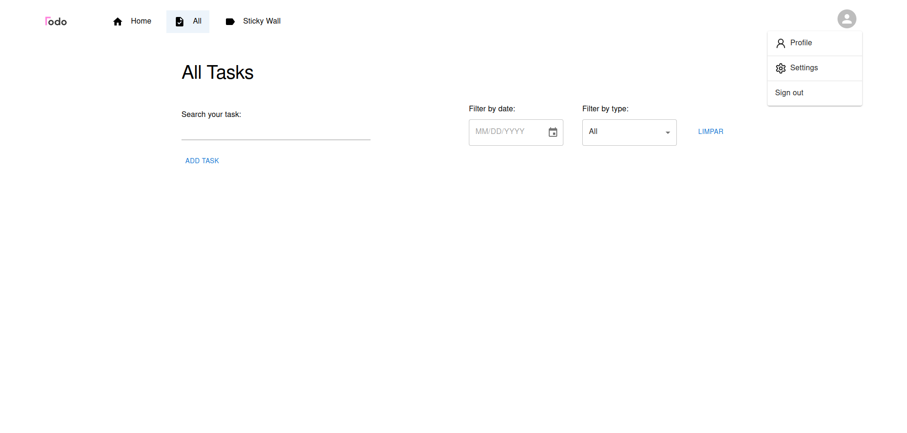

# Todo from Todo

Welcome! This is a simple project, that allow users to create and manipulate their tasks.

# About

The goal of this project is to improve my skills, here I started to use different git branches to organize and practice my skills with git, of course
I am training other features, frameworks and libs. Another goal is to use it to remind myself of my tasks LMAO.



## Reqeuriments

1. NextJS
2. NodeJS
3. MaterialUI
4. Firebase

### Frontend

1. Clone this repo

```bash
git clone https://github.com/Rafael-Urei/todo.git
```

2. Go to the project folder

```bash
cd todo
```

3. Install dependencies

```bash
npm install
```

3. Run Frontend

```bash
npm run dev
```

Thanks !!
